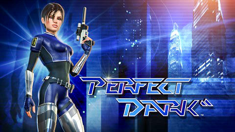

# Perfect Dark Remaster Recompilation

<div align="center">
  
</div>

A static recompilation of **Perfect Dark Remaster** (2019, Xbox One, Title ID `584109C2`) to native Windows x86-64, built on the [ReXGlue SDK](https://github.com/rexglue/rexglue-sdk).

Static recompilation translates the Xbox One PowerPC code inside the game's `default.xex` into native C++ that compiles and runs on a PC. There is no emulator and no interpreter in the loop; file I/O, GPU commands, audio and threading go through the ReXGlue runtime.

## Status

- **Working build.** The project compiles cleanly and the executable boots to real Direct3D 12 rendering with audio, controller support, and the texture-noise fix applied.
- **Codegen runs clean.** Analysis of `assets/default.xex` produces 0 errors; the code range `0x820C0000-0x825BB934` (≈ 4.8 MB, 12 928 functions) is fully covered.
- **Both graphics backends compiled in.** The SDK is built from source with `REXGLUE_USE_D3D12` and `REXGLUE_USE_VULKAN` both enabled, so `--graphics_backend=d3d12|vulkan` can be switched at runtime.
- **SDK built from source.** Unlike projects that vendor a prebuilt SDK archive, this repo pulls the ReXGlue SDK as a git submodule at [`thirdparty/rexglue-sdk`](thirdparty/rexglue-sdk) and builds it together with the game. This makes CPU optimization presets (`-march=native`, AVX-512, ...) and Tracy profiling available in the same build.
- **Debug instrumentation wired up.** `win-amd64-relwithdebinfo` builds enable `REXGLUE_ENABLE_PERF_COUNTERS` and link `TracyClientrd.dll`, so per-frame CSV metrics and Tracy profiling both work out of the box. See [`tools/benchmark.ps1`](tools/benchmark.ps1) and [`tools/analyze_benchmark.py`](tools/analyze_benchmark.py).

## Features

- **Native Windows build** — no emulator, no interpreter; the game's own PowerPC code is compiled to x86-64.
- **Dual graphics backend** — pick Direct3D 12 or Vulkan at runtime via `--graphics_backend` or `settings/hardware.toml`.
- **CPU optimization presets** — `-march=native`, `avx512`, `avx2`, `generic`, or `none` via the `REX_CPU_PRESET` CMake cache variable (see [`cmake/cpu_presets.cmake`](cmake/cpu_presets.cmake)).
- **Texture noise fix** — ported from the community xenia-canary `game-patches` for Perfect Dark (`584109C2`), applied as a direct guest-memory write in [`src/game_patches.h`](src/game_patches.h). Enabled by default in [`settings/hardware.toml`](settings/hardware.toml).
- **Runtime debug tools** — stub sweep and missing-function scan gated behind the `dev_debug_runtime` cvar; produces `logs/stub_sweep.txt` and `logs/missed_functions.txt` for ongoing work on unregistered addresses.
- **Performance benchmarking** — `tools/benchmark.ps1` runs the game on both backends for a fixed duration and prints a side-by-side comparison; `tools/analyze_benchmark.py` computes FPS / frame-time percentiles from the CSV.
- **Ghidra dump exporter** — [`tools/ExportProgramDump.java`](tools/ExportProgramDump.java) exports symbols, functions, disassembly and cross-references from a Ghidra analysis of `default.xex` into `dump/default/`.
- **SDL gamepad support** — `settings/gamecontrollerdb.txt` is staged next to the exe so controllers SDL doesn't already recognize still work.

## Requirements

- CMake 3.25+
- Ninja
- Clang / LLVM (clang-cl works too) — MSVC alone will not build this
- Windows SDK (for D3D12) and Vulkan SDK (for Vulkan)
- Git with submodule support (the SDK is a submodule)
- Your own legally-owned copy of **Perfect Dark Remaster**, extracted from the Xbox One disc/ISO

## Getting the SDK

The SDK is a git submodule at [`thirdparty/rexglue-sdk`](thirdparty/rexglue-sdk). After cloning:

```powershell
git submodule update --init --recursive
```

That's it — `CMakeLists.txt` already points `REXSDK_DIR` at the submodule, so the build picks it up automatically.

## Getting the game data

1. Extract the Xbox One ISO with [XBLA-Extract](https://github.com/ryzendew/XBLA-Extract) (or a similar tool such as [xplorer360](https://github.com/XboxDev/xplorer360/releases) / [extract-xiso](https://github.com/XboxDev/extract-xiso/releases)).
2. Copy the extracted contents into `assets/`, so it looks like:
   ```
   assets/
     default.xex
     DataFiles/
     ...
   ```
3. `assets/` is gitignored (`assets/*` in `.gitignore`) — nothing from the disc is, or should be, committed to this repo.

## Build

```powershell
cmake --preset win-amd64-relwithdebinfo
cmake --build out/build/win-amd64-relwithdebinfo
```

Other available presets: `win-amd64-debug`, `win-amd64-release`, `win-arm64-*`, `linux-amd64-*`, `mac-amd64-*`, `mac-arm64-*`.

To pick a CPU optimization preset, pass `-DREX_CPU_PRESET=native` (or `avx512`, `avx2`, `generic`, `none`) to `cmake`.

Codegen (translating `assets/default.xex` into `generated/default/*.cpp`) runs automatically as a build step (`perfectdarkremasterrecomp_codegen` CMake target) whenever `perfectdarkremasterrecomp_manifest.toml`, `default_functions.toml`, or the `.xex` itself changes.

## Run

```powershell
cd out\build\win-amd64-relwithdebinfo
.\perfectdarkremasterrecomp.exe
```

Both `--game_data_root` and `--gpu_plugin` are optional: `OnConfigurePaths()` in [`src/perfectdarkremasterrecomp_app.h`](src/perfectdarkremasterrecomp_app.h) defaults `game_data_root` to `<repo_root>/assets` (found by walking up from the exe folder) when it isn't set via flag/env var, and `gpu_plugin = "xenos"` already lives in [`settings/hardware.toml`](settings/hardware.toml). Pass either flag to override.

Useful flags/env vars while developing:

| Flag / env var | Effect |
|---|---|
| `--game_data_root <path>` | Overrides the default `<repo_root>/assets` game-files location. |
| `--graphics_backend d3d12\|vulkan\|any` | Forces the graphics API `rexgpu-xenos` uses. Default `"any"` picks D3D12 first. |
| `--gpu_plugin xenos` | Overrides `settings/hardware.toml`'s `gpu_plugin`. |
| `--perf_log_csv=<path>` | Per-frame metrics CSV (only when built with `REXGLUE_ENABLE_PERF_COUNTERS`). |
| `REX_CPU_PRESET` | CMake cache variable, not a runtime flag — see [Build](#build). |

Logs are written to `out\build\<preset>\logs\*.log` (the exe is built `WIN32`, so nothing prints to the console).

## Configuration

Rendering/window/vsync and input-backend defaults are checked in under [`settings/`](settings/README.md) (`hardware.toml` / `mapping.toml`), loaded automatically at startup. CLI flags and `REX_*` environment variables always override them — see [`settings/README.md`](settings/README.md) for the full reference and precedence rules.

## Project structure

```
.
├── assets/                     # Game data (default.xex + files) — gitignored
├── cmake/
│   ├── cpu_presets.cmake       # CPU optimization presets (native / avx512 / avx2 / ...)
│   └── fix_symlinks.cmake      # Fixes git symlinks on Windows (libmspack in SDK)
├── dump/default/               # Ghidra analysis dump of default.xex (checked in)
├── generated/                  # Codegen output (gitignored) + rexglue.cmake
│   └── default/                #   *.cpp / *.h per partition
├── out/                        # Build output (gitignored)
├── settings/                   # Checked-in hardware.toml / mapping.toml / gamecontrollerdb.txt
├── src/
│   ├── main.cpp                # REX_DEFINE_APP entry point
│   ├── perfectdarkremasterrecomp_app.h   # App hooks (OnPreSetup, OnPostSetup, ...)
│   ├── game_constants.h        # Code-range constants (kCodeBase / kCodeEnd)
│   ├── game_cvars.h            # Project-defined cvars (graphics_backend, ...)
│   ├── game_patches.h          # Texture-noise fix (guest-memory write)
│   ├── debug_tools.h           # Stub sweep + missing-function scan
│   └── utils.h                 # Repo-root discovery + settings loading
├── thirdparty/rexglue-sdk/     # ReXGlue SDK (git submodule)
├── tools/
│   ├── benchmark.ps1           # D3D12 vs Vulkan benchmark runner
│   ├── benchmark.sh            # Same, for Linux/macOS
│   ├── analyze_benchmark.py    # FPS / frame-time statistics from CSV
│   └── ExportProgramDump.java  # Ghidra script for exporting analysis
├── CMakeLists.txt
├── CMakePresets.json           # Platform presets (win/linux/mac × amd64/arm64)
├── CMakeUserPresets.json       # Local presets (inherits platform presets)
├── default_functions.toml      # Manual function boundaries for codegen
└── perfectdarkremasterrecomp_manifest.toml
```

## How this project was set up

1. `rexglue init --project-name perfectdarkremasterrecomp --xex-path assets/default.xex` generated `CMakeLists.txt`, `CMakePresets.json`, `perfectdarkremasterrecomp_manifest.toml`, `generated/rexglue.cmake`, `src/main.cpp`, `src/perfectdarkremasterrecomp_app.h`.
2. Added the ReXGlue SDK as a git submodule at `thirdparty/rexglue-sdk` and pointed `REXSDK_DIR` at it in `CMakeLists.txt` — the SDK is built from source rather than a prebuilt archive.
3. Enabled both graphics backends (`REXGLUE_USE_D3D12` on Windows, `REXGLUE_USE_VULKAN` everywhere) and added CPU optimization presets via [`cmake/cpu_presets.cmake`](cmake/cpu_presets.cmake).
4. Added `GPU_PLUGINS xenos` to the `rexglue_setup_target()` call in `CMakeLists.txt` so `rexgpu-xenos*.dll` gets staged next to the exe.
5. Added `src/game_patches.h` with the texture-noise fix (ported from xenia-canary `game-patches` for `584109C2`), applied in `OnPostLoadXexImage()`.
6. Added `src/debug_tools.h` with the stub sweep and missing-function scan, gated behind the `dev_debug_runtime` cvar so they don't run by default.
7. Added benchmarking tools (`tools/benchmark.ps1`, `tools/analyze_benchmark.py`) and a Ghidra dump exporter (`tools/ExportProgramDump.java`).

## Known issues and difficulties encountered

- **Manual function boundaries are an ongoing, iterative process.** The game's code has call sites the static analyzer cannot see ahead of time (plain branches to un-analyzed code, and indirect calls through vtables/callback tables resolved only at runtime). `default_functions.toml` grows one play session at a time via the stub sweep described above.
- **Access violations from stubbed calls.** A stubbed function is a no-op — it does not set a return value. If the caller dereferences whatever was left in `r3`, that can crash with an unrelated-looking guest access violation until the real function is added to `default_functions.toml` and actually executes.
- **The `rexglue` CLI must be invoked through the SDK source tree.** Because the SDK is built from source, the `rexglue` binary is produced by the same build as the game; running codegen manually requires the SDK to have been built first.

## Credits

- [ReXGlue SDK](https://github.com/rexglue/rexglue-sdk) ([releases](https://github.com/rexglue/rexglue-sdk/releases))
- [xenia](https://github.com/xenia-project/xenia) / [xenia-canary](https://github.com/xenia-canary/xenia-canary) — ReXGlue's runtime is derived from Xenia's, and the [compatibility list](https://github.com/xenia-canary/game-compatibility/issues) was used to help pick this game as a recompilation target.
- [mdqinc/SDL_GameControllerDB](https://github.com/mdqinc/SDL_GameControllerDB) — controller mappings staged next to the exe.
- [ryzendew/XBLA-Extract](https://github.com/ryzendew/XBLA-Extract) — used to unpack the Xbox One ISO.
- [zerokilo/xexloaderwv](https://github.com/zerokilo/xexloaderwv) — Ghidra plugin used to load and analyze `default.xex` for the dump in [`dump/default/`](dump/default/).
